# 🔒 Celock

**Turn Bot Traffic into Revenue with Celo Micropayments.** *The plug-and-play firewall that makes bots pay their way, built on `x402 Standard`.*

**🏆 A Hackathon ORIGINS @ TOKEN2049 Project**

-----

## 💡 The Big Idea

The web is drowning in automated traffic. Bots, scrapers, and AI agents generate billions of requests, consuming vast resources and creating unsustainable costs for developers and creators. The old defenses—CAPTCHAs and IP bans—are failing. They punish legitimate users and offer no way to capture the value this traffic generates.

**Celock flips the script.** We transform parasitic bot traffic into a sustainable, machine-native economy. Using the underutilized `HTTP 402 Payment Required` standard and the speed of Celo, Celock is a simple firewall that challenges automated clients to pay for the resources they consume.

No more free rides. If a bot wants your data, it has to pay for it—instantly, transparently, and fairly.

## 🌪️ The Problem

  - **💸 Unmonetized Traffic:** Bots and AI agents consume massive bandwidth and compute power, almost always for free.
  
  - **📈 Spiraling Costs:** Every bot request incurs real infrastructure costs, directly eating into your margins.
  
  - **🚫 Broken Defenses:** CAPTCHAs and IP bans are blunt instruments that create friction for users and are easily bypassed by sophisticated bots.
  
  - **🌉 Missing Infrastructure:** There is no seamless, standardized way for machines to pay other machines for API calls or data access.

## 🚀 Our Solution: The Celock Protocol

Celock is a lightweight, plug-and-play proxy that sits in front of any existing website, web app, or API. It enforces payment-gated access without requiring any changes to your core application logic.

#### The Flow in Action:

```mermaid
sequenceDiagram
    participant Bot as 🤖 Compliant Bot
    participant Celock as 🔒 Celock Proxy
    participant Celo as 🪙 Celo Blockchain
    participant Server as 🖥️ Your Website/App

    Bot->>Celock: 1. Request resource (e.g., GET /page.html)
    Celock-->>Bot: 2. Challenge with HTTP 402 (Invoice ID + Price)
    Bot->>Celo: 3. Pays invoice in cUSD/Celo to Smart Contract
    Celo-->>Bot: Transaction Confirmed
    Bot->>Celock: 4. Retry request with Proof of Payment (Tx Hash)
    Celock->>Celo: 5. Verifies payment on-chain
    Celo-->>Celock: Payment Valid
    Celock->>Server: 6. Forwards original request
    Server-->>Celock: Serves resource
    Celock-->>Bot: 7. Success! (HTTP 200 + Data)
```

## 🛠️ Key Features

 - 🛠️ Key Features
⚡ Instant Plug-and-Play Gateway: The core of Celock is a non-intrusive proxy that protects any endpoint. Its key advantage is simplicity—you can deploy it in minutes to monetize traffic without modifying a single line of your existing application code.

- 🪙 Architected for Celo Efficiency: Our protocol is designed specifically to leverage Celo's unique advantages. This architecture ensures that payments are primed for ultra-low gas fees and rapid transaction finality, making true, cost-effective micropayments practical at any scale.

- 🌐 Built on an Open Standard: By using HTTP 402, Celock is inherently open and extensible. This provides a universal, future-proof foundation for a complete machine economy, creating a clear path for ecosystem tools like bot SDKs and revenue dashboards to be built on top.

  ## Example Implementations on Mainnet:
 - https://celoscan.io/tx/0xd819683e1066d12b53c58e7ee46bb908c9550f41b8d1692e8c8e9cf69e8358bf
 - https://celoscan.io/tx/0x82e9279cab198549842ab3fe0ba4090c737d140fc31765daeae76fcd1a5b2f04
 - https://celoscan.io/tx/0xb25a95a1662268e58abeb640ba13d0d53dddb2146464f122fb764f9b0dcf8305

## 📦 Use Cases

Who is this for?
- 🌐 **Websites & Publishers**: Tired of bots scraping your website's content for free? Celock forces them to pay for the privilege. Protect your articles, product listings, or data while creating a new revenue channel from automated traffic.

- 🤖 **API Providers**: Your API is valuable. Celock ensures you get paid for every automated call, turning traffic that currently costs you money into a predictable revenue stream.

- 🧠 **AI Agent Developers**: Build truly autonomous agents. Celock is the native payment layer for the machine economy, enabling your AI to seamlessly pay for the data and services it needs on the fly, without human intervention.

## 💰 Business Model

Celock is designed for flexibility and scale:

  - **Pay-per-Request:** A small fee is taken from each successful micropayment.
  - **Prepaid Credits:** Bots can pre-purchase credits for uninterrupted access.
  - **Tiered Subscriptions:** Offer premium tiers with lower fees, higher rate limits, or surge protection.
  - **Enterprise SaaS:** Provide Celock as a managed service for large-scale API providers.

## 🧠 Tech Stack

  - **Proxy Server:** Node.js, Express.js
  - **Blockchain:** Solidity on Celo (Mainnet)
  - **Web3 Interaction:** ethers.js, Web3.js, Thirdweb SDK
  - **Frontend:** React js(Vite)

-----

## 🧾 License

This project is licensed under the **MIT License**. Use it, fork it, build something amazing on it.

-----

## 🧠 Made at Hackathon ORIGINS TOKEN2049

**By The FinalBOSS Squad**

  - **Guilherme dos Santos de Almeida Silva** – `gsantos@bankbook.com.br`
  - **Ademola Adebowale** – `ademolajohn844@gmail.com`
  - **Kwang Wei Sim** – `kwang@adappter.xyz`
  - **Samuel Danso** – `me.samueldanso@gmail.com`
